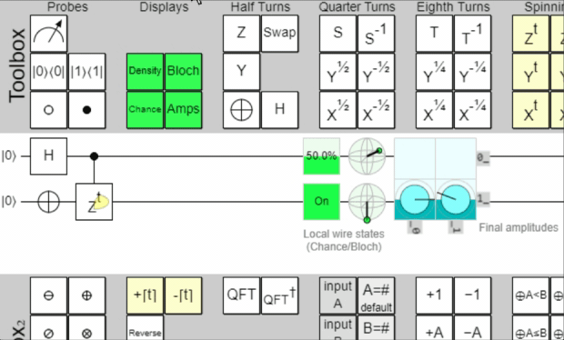

+++
title = "Understanding Quantum Phase Kickback"
description = "A breakdown and walkthrough of Quantum Phase Kickback and how it works"
image = "quantum-phase-kickback.gif"
date = 2023-12-22
+++

Quantum Computing is really fascinating! It's really cool! Sometimes it's just weird. Now
you've probably heard of entanglement, no-cloning, teleportation, and some other interesting
quantum properties and phenomena. But these lists often overlook the unsung hero of many
important quantum algorithms, Quantum Phase Kickback.

## Why does no one talk about Quantum Phase Kickback?
Most of the resources (even beginner resources) where it's referenced
simply report that it's used and spend zero time elaborating. Several well-known
algorithms such Shor's and Grover's readily make use of Quantum Phase Kickback. And 
ultimately the reason for this lack of explanation is simple. It's just not that
complicated, but it's still confusing at least for beginners.

You see, mathematically Quantum Phase Kickback is completely explained by our current
understanding of quantum operations being represented by matrix operations. That said,
what is explained by matrix operations is still not necessarily intuitive. But at the
end of the day, one might call Quantum Phase Kickback an slightly unintuitive quirk, and
not a hallmark of quantum mechanics, and therefore while important to understand barely any
resources actually discuss it.

## What is Quantum Phase Kickback
So what exactly is Quantum Phase Kickback? Well, it's a particular nuance that occurs
when a Controlled Phase Gate is applied to a control in superposition and a target in
the on-state.

### What's is Intuitively Supposed to Happen
Traditionally, for a controlled gate of any kind, we can expect that the
control will be unmodified, but the target will be modified based on the |0> or |1>
state of the control, if the control is in superposition then this can be used to
entangle two qubits.

### What Mathematically and Physically Happens
What actually occurs as I said before is a unique quirk. When a controlled phase
gate is applied with the control qubit in superposition then some amount of that
phase change will "kickback" and apply to the control. The amount that kicks back
directly corresponds with the probability of the target qubit being |1>. Being in
the 1|> state will kickback all of the phase change to the control qubit.

Here's a wonderful little animation I recorded of a circuit demonstrating quantum phase
kickback on Quirk.

## Why is Quantum Phase Kickback important?
Quantum Phase Kickback is important in various algorithm's such as Grover's because
it represents a way to mark particular qubits without changing their collapse probabilty
in the Z basis, that is |0> and |1>. This is useful because under various rotation
circumstances, or if measuring in different bases, such as |i> and |-i> or |-> and |+>,
the results of these measurements can be the byproduct of earlier "phases kickbacks" or
"marking" in the case of the application Grover's Algorithm's oracle.

